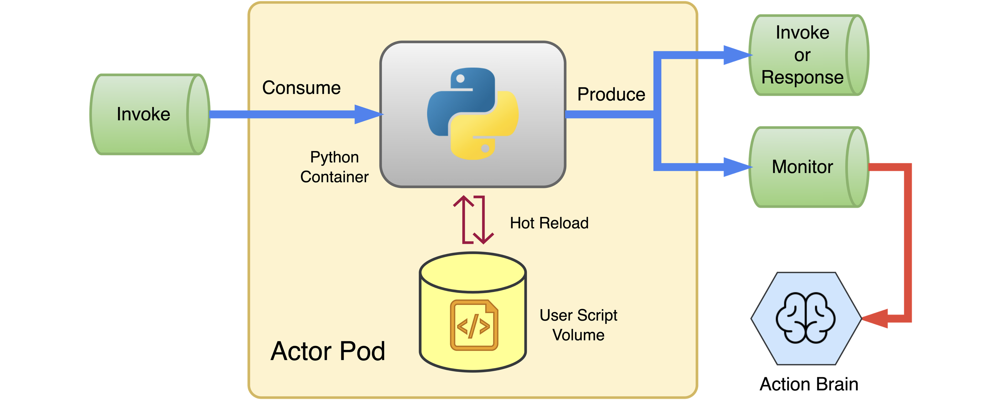
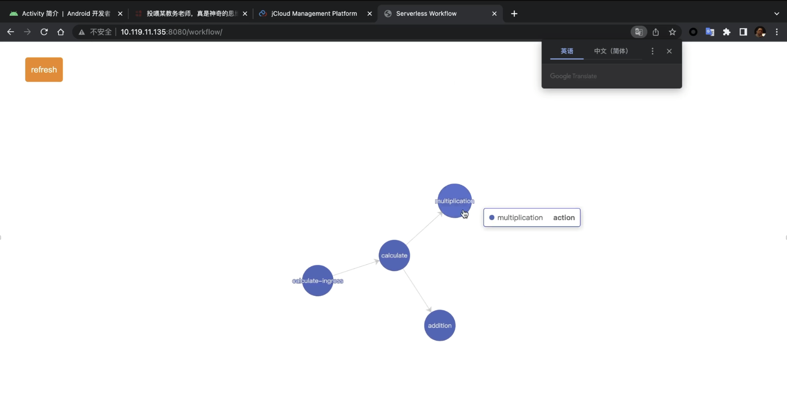

# Cubernetes验收报告

## 架构介绍

### 软件栈

- 编程语言：Golang
- HTTP服务：GIN
- API对象持久化：ETCD
- 容器运行时：Docker
- CNI插件：Weave
- Serverless消息队列：Kafka

### 使用的依赖

- 没有使用k8s.io组织下的任何依赖和库，没有使用Knative, openwhisk有关的任何依赖和库
- 没有使用CNI库，但容器间网络连接是利用Weave实现的
- 主要使用了etcd, kafka, iptables client封装对这些外部组件的操作


<center>图1 Cubernetes依赖搜索</center>

### 整体架构


<center>图2 Cubernetes整体架构图</center>

图2展示了Cubernetes的整体架构设计。与K8s类似，Cubernetes的组件也分为控制面和数据面。

控制面围绕中心的API Server进行设计，包含ETCD, Scheduler, Controller Manager和Action Brain等组件。

- ETCD中存放了各类api对象，暴露grpc供API Server读写。
- API Server则对外提供RESTful的HTTP服务，以实现对API对象的访问和watch。
- Scheduler通过watch的方式监听API Server中Pod, Node等对象的变化，对Pod进行动态调度。
- Controller Manager也通过watch来管理ReplicaSet等对象。
- Action Brain则负责管理Serverless的相关功能。

数据面的组件在每一台服务器上均有运行，整体形成一个Node抽象。

- Cubelet通过dockershim与docker后端交互，负责Pod生命周期的管理。
- CubeProxy则通过nginx容器实现DNS，通过设置iptable实现Service流量的转发，并通过Weave插件来打通Pod之间的网络通信。
- Cubelet和CubeProxy都通过watch和RESTful接口访问API Server中的api对象。
- Serverless的组件以Pod的形式运行在各个机器上，并通过各机器上部属的Kafka消息队列进行通信，形成Serverless DAG.
- 用户可以使用Cuberoot来管理集群（包括加入、启动、关闭、重置、开启Serverless等），可以用Cubectl对API对象进行操作（包括apply, create, get, describe, delete等）。

### Serverless 架构



<center>图3 Actor架构</center>

如图3所示，用户的函数称为Action，执行Action的Pod称为Actor。Actor里运行了Python解释器的容器，通过Volume Mount的方式加载用户函数脚本，在函数更新时也可以进行热重载，不必重启解释器。各个Actor之间通过Kafka消息队列连接，形成一条函数调用链。Actor消费一条调用请求（Invoke消息），执行用户函数，产生新的调用请求或返回值（Invoke或Response消息），放入对应接收者的消息队列中，同时还要发送调用记录给Action Brain，供其监控各个函数的调用次数，以便实现动态扩缩容以及函数冷启动时的快速响应。


<center>图4 Serverless Workflow调用逻辑</center>

图4展示了一个完整的Serverless Workflow的执行流程。用户调用函数时，Gateway收到用户请求后就封装一个Invoke消息，然后等待接收到Response消息后将内容返回给用户。

Gateway和Actor都运行在Cubernetes集群之上，沿用了ReplicaSet/AutoScaler的抽象，Kafka也以多机模式运行在各节点上。整个架构呈现出一种流水线处理的形式，可以取得更高吞吐性能和更小的通信开销，有良好的健壮性和可扩展性。

### Serverless 编程模型

Cubernetes有**易用**的编程模型。Cubernetes中并没有组件来处理函数调用分支，这是因为分支的逻辑包含在用户代码中，用户可以自由地选择下一个调用的函数是什么，Cubernetes只在Python运行时中做了合法性的检查，这样可以获得更高的**编程灵活性**，函数调用的写法也更**符合直觉**。

```python
# 这个案例展示了serverless action的编程模型：action.py
# serverless软件包是Cubernetes提供的
from serverless import Request, Response, Invoke
from http import HTTPStatus

# req: 封装的调用请求 e.g. http://172.16.0.0:6810/calculate?a=1&b=2&sign=%2B
def action(req: Request) -> Invoke or Response:
    a = int(req.param('a'))
    b = int(req.param('b'))
    s = req.param("sign")

    if s == '+':
      	# 调用名为addition的action，自然地形成Workflow
        return Invoke("addition", params={'a': a, 'b': b})
    elif s == '*':
        return Invoke("multiplication", params={'a': a, 'b': b})
    elif s == '>':
      	# 直接返回结果
        return Response(str(a > b) + "\n")
    elif s == '<':
        return Response(str(a < b) + "\n")
    elif s == "==":
        return Response(str(a == b) + "\n")
    else:
      	# 结果中可以指定 content-type 和 http status code
        return Response("unknown sign: {}\n".format(s), http_status=HTTPStatus.BAD_REQUEST)
```

同时，为了方便用户构建自己的Workflow，Cubernetes在Master节点的8080端口为用户提供了可视化的网页视图，清晰地展示函数DAG。



<center>图5 Serverless Workflow可视化</center>

### 多机部署

- cuberoot通过是否存在元信息持久化文件判断应该新创建并且加入一个Cubernetes节点还是恢复之前的数据
- Scheduler调度优先满足Pod selector, 在匹配的Node集合中，Scheduler会进行Round Robin调度
- Worker通过监测Watch channel的状态判断Master的存活状态，周期性的重连实现容错
- Master通过心跳检测探测worker状态，更新ETCD中存储的Node状态

> 为了优化阅读体验，我们将我们组件的详细实现放在了最后一个Section. 阅读上述内容已经可以了解我们的基本实现，如果您想了解更多，可以通过书签快速找到对应组件进行阅读。(以下是内容梗概)
>
> - <a href="#cubelet">Cubelet 自上而下的调用链与底层实现逻辑</a>
> - <a href="#informer">如何用Informer提高性能</a>
> - <a href="#network">Cubenetwork如何连接，如何实现DNS</a>
> - <a href="#pod-like">如何抽象“类Pod对象”复用代码</a>
> - <a href="#serverless">如何复用原有组件实现Serverless的全局高可扩？</a>
> - <a href="#hot-reload">Serverless脚本热重载如何实现？</a>
> - <a href="#update">我们的架构怎么快速的能够引入新功能？</a>

## 成员分工

<center>表1 成员分工与贡献度</center>

| 成员                | 工作                                                         | 贡献度 |
| ------------------- | ------------------------------------------------------------ | ------ |
| 沈玮杭 519021910766 | API Server & Client, GPU Job Server, Serverless Python Runtime | 1/3    |
| 杨镇宇 519021910390 | Cubelet, Controller Manager, Action Brain                   | 1/3    |
| 李逸岩 519021911103 | CubeProxy, Scheduler, Serverless Gateway, Sufficient test    | 1/3    |

## 工程实践

### Gitee 地址: 

- Cubernetes https://gitee.com/k9-s/Cubernetes
- Serverless Python框架 https://gitee.com/k9-s/Serverless-Python
- Slides https://jbox.sjtu.edu.cn/l/61Ss9l
- 未剪辑/剪辑配音视频 https://jbox.sjtu.edu.cn/v/link/view/f0f76f7aad094521a8258a8d05ee5153

### 项目分支

- master 项目主分支，长期存在。仅由develop branch通过pull request合入，合并时机为完成了一个完整的，经过集成测试的主要功能之后；
- develop 项目开发分支，长期存在。仅由功能分支通过pull request合入，合并时机为完成了一个经过测试的功能点之后；
- 其他功能分支，有明确的生命周期。在开启一项独立的任务之后，由任务负责开发者创建，将在任务开发完毕后合入develop分支(或者使用此分支feature的其他分支)并且删除。

### CI/CD

使用Gitee[仓库镜像](https://gitee.com/help/articles/4336)到Github私有仓库，使用Github Campus(白嫖)的Github Action time(3K minutes/month)进行CI. 使用的Workflow配置yaml文件可以参考附件1. 主要完成的工作：

* 运行`go build`确保编译通过
* 运行`go vet`捕获是否存在编译器未发现的错误
* 运行`staticcheck`进行静态代码检查
* 运行`go test`完成单元测试
* 如果CI不通过，会通过邮件通知小组

Github Action在镜像同步后会自动触发：


<center>图6 Github Action</center>


<center>图7 Github Workflow执行结果</center>

由于本身云操作系统并非持续服务的Web server或其他服务，因此没有进行持续部署。

**我们使用了一套基于Rsync和IDE的自动化部署的方案。**用于集成测试的部署方式是基于Jetbrain Deployment和Linux rsync进行同步与部署的：

- 在Jetbrain worker group 中创建两台JCloud服务器，填入ssh连接信息
- 配置rsync连接，将本地Cubernetes开发目录映射到部署目录，这一步需要排除build等目录
- 在Jetbrain Goland中配置rsync，在git merge/代码本地修改时触发rsync到远程服务器Group
- 在JCloud机器上进行构建和部署

### 软件测试

- 单元测试使用go test. test目录一般在相应组件目录下方，命名为`function_test.go`, 内部函数Pattern为`TestSomeFunction(t *testing.t)`签名的即为单元测试函数
- 集成测试则使用`/example`下的yaml文件进行测试，并且通过docker, log等观察是否运行正常
- 回归测试依靠CI进行
- log 是进行Debug的主要工具，如果使用`cuberoot`启动Cubernetes，log会被重定向到`/var/log`
  - 同时通过sync映射到本地便于查看


###  新Feature开发流程

- 分工，如果和其他模块有交互部分需要讨论接口，涉及多个模块的需要会议讨论
  - 需要讨论接口的情形：如何向`iptables utils`发起创建规则链调用
  - 需要腾讯会议的情形：Serverless组件之间的进程间通信使用消息队列还是HTTP
  - 需要通过Git Wiki的情形：预研GPU CUDA程序的成员将Note记录在Wiki上
- 从Develop分支创建Branch并且推送至远程存储库
- 编写Feature所需的组件或者修改原有组件完成新Feature
- 编写单元测试，检查测试是否通过
- 编写对应的集成测试用例，在JCloud上部署并进行集成测试
- 推送到Gitee，Pull request, Git message 应该遵守[Conventional Commit](https://www.conventionalcommits.org/en/v1.0.0/), 即`<type>: <subject>`. 
  - 如果提交比较复杂，还要提交一份含有Body的Git message.
  - `<type>`应为`feat, fix, docs, refactor, test, chore, style`中的一种
- 进行code review, 然后合入Develop分支，Develop分支则需要经过完整的回归集成测试后才能合入主线

## 功能介绍

我们在Slides中精心设计了11个Case。高效地覆盖了验收指南的几乎每一句话，您可以参考ppt中的yaml文件设计和对应视频文件。如果想下载视频或者查看未经任何剪辑的源文件，也可以通过[Jbox](https://jbox.sjtu.edu.cn/v/link/view/f0f76f7aad094521a8258a8d05ee5153)访问。

下面补充一些case，覆盖边界条件以及没有来得及演示的内容。GPU代码讲解，可以在附件一查看。

### HPC扩缩容速度

演示时使用的配置文件使用了默认的伸缩速度（最小间隔20秒），下面一组例子演示了更慢的伸缩速度（最小间隔80秒），可以对比体现“通过配置文件改变扩缩容速度”的功能点。通过指定yaml中Spec里的minScaleInterval参数即可。

```
# Keep scaling (but slower)
./build/cubectl apply -f ./example/yaml/slow-autoscaler.yaml
```

### 快速Service恢复

演示中提到，Service在某个Pod挂掉之后，最迟在7s(Cubelet监测pod状态超时时间，可以配置)内可以发现并且重设iptables. 这是基于Watch机制实现的。

```
./build/cubectl apply -f ./example/yaml/presentation/rs.yaml
./build/cubectl apply -f ./example/yaml/presentation/svc-1.yaml

docker stop [any docker ID]
curl 172.16.0.0:8080 # 最多有7-10s可能被负载均衡到失效节点上
# 如果允许Cubernetes占用更多资源，可以减少这一时间
# pod重启，service也能在超时时间内恢复负载均衡
```

### 跨子网集群的部署

由于我们没有假定过需要各个机器处于同一子网内，也不要求机器间联通的IP和某个特定网卡绑定，可以轻松扩展到各个子网集群。

```
./build/cuberoot init -f ./example/yaml/presentation/cross-master.yaml
./build/cuberoot join 10.119.10.255 -f ./example/yaml/presentation/cross-worker.yaml
```

## 组件介绍

### API Server

API Server使用了GIN框架提供HTTP服务，通过grpc请求访问ETCD。其余组件可以通过RESTFul的HTTP请求读写API Server中的api对象，也可以通过基于HTTP长连接的watch接口监听api对象的变化。API Server还提供了接口来读写用户提交的Job文件和Serverless函数脚本。

为了让控制面和数据面彼此能够检测到对方的在线状态，他们通过TCP Socket建立连接并发送心跳包。如果一段时间内没有收到心跳包，API Server便认为某个Node掉线，并更新其状态。

### Cubelet
<a name="cubelet"></a>

Cubelet组件运行在每个Node上，负责对本地运行的Pod对象进行管理：包括从API-Server监测对Pod对象的状态操作（如创建、更新和删除），以及定时监控、计算本地所有Pod对象的状态，并将其同步到API-Server中。

<a name="pod-like"></a>
出于通用性和效率的权衡考虑，Cubelet将管理的“类Pod对象”分为三种：

+   最为泛用的Pod对象，一般用于持续运行的workload，具有刷新Spec，监控资源利用状态等所有功能，运行开销也最大，是项目使用与演示中主要用到的对象；
+   GPU应用专属的GpuJob对象，是专门为运行一段GPU计算任务（Job）实现的抽象；
+   Serverless部分中运行Action实例的Actor，使用一个内部定义的Python-Runtime镜像，并且会自动生成其专属的cmd，也不监控其资源利用率，有较小的运行开销和较快的启动速度。

Cubelet组件主要由以下几个层次组成（调用栈从上到下）：

1. Informer：

   各个对象的informer组件使用API-Server提供的List-And-Watch接口，监控其中对象的状态变化，并暴露为统一的Event管道，以便调用各种事件（Create, Update, Remove）的Handler。在这层，基于NodeID过滤掉尚未Schedule/非本地的Pod对象。

   <a name="informer"></a>
   由于informer监控了所有属于当前Node的类Pod资源的状态变化，因此也在其中维护了每个资源的本地Cache，可以避免Cubelet大量向API-Server发送查询请求，减少其负载。

   List-And-Watch接口也可用来监控本地节点与API-Server的连接情况，如果控制节点下线，Cubelet将在这层反复尝试与控制面重新建立连接，达成容错的效果。

2. Handler：

   这一层是Cubelet的主要逻辑处理部分：通过Select机制监听Informer层提供的事件channel，调用各种Pod对象的Create, Update, Remove事件的响应处理逻辑函数；同时对于每种类Pod对象都有一个定期Routine，监控、计算出本地运行对象的状态，将其更新到API-Server中。

3. Runtime：

   对于三种不同的类Pod对象，基于Dockershim暴露的docker相关接口，封装了对象独有的启动、同步、停止、监控等操作，供上层Handler进行调用，使得编写Handler时只用关心业务逻辑而无需直接与docker接口交互。

4. Dockershim：

   对于docker sdk的简单封装，提供给Runtime使用，用于对容器、镜像的各种操作。

### CubeProxy与Cubernetes网络
<a name="network"></a>

- 以Weave Plugin为基础，用户**无感知**的下载与配置插件，不需要用户额外配置任何网络
  - Pod中容器共享Pause提供的网络，Pause加入Weave net, Pod中容器共享Localhost
  - Container内可以通过任意节点的IP，任意Pod IP和Service IP 以及注册的域名访问对应服务
  - 动态节点加入与删除
- Service: 基于IPtables, 自动化的配置
  - 自定义多层规则链，相互引用，便于更新，删除，新增Service
- 容器化Nginx实现DNS服务
  - 观察到不同Path对应不同的IP超出了DNS职责，通过Nginx实现不同path到不同IP的转换
  - 复用Service进行Pod负载均衡

### Controller-Manager

Controller-Manager运行在控制面上，负责保证高级对象（ReplicaSet, AutoScaler）的运行状态符合其定义。该组件只与API-Server组件交互，从其中监测各类对象的状态变化，计算出为了达到目标状态所需进行的操作，并将操作通知到API-Server中。由于交互链较为简单，因此该组件的分层逻辑也很简洁：

1. Informer：

   与Cubelet组件中的Informer相似，也通过List-And-Watch机制监控了API-Server，提供了组件内的对象Cache（Pod, ReplicaSet, AutoScaler），向下暴露了事件通知channel，提供容错机制；由于多个Controller可能需要监控同一个资源，Informer可以同时建立多个事件通知channel，多个Controller也能共用同样的Cache，保证了资源信息一致性。

2. Controller：

   每个高级对象（本项目中是ReplicaSet和AutoScaler）都对应了一个Controller，可以按需传入Informer作为参数创建，以此监控对应的事件通知channel。Controller中通过handler处理每种资源对象的Create, Update, Remove事件，也会通过定时Routine检查高级对象是否符合目标状态，并通过合理的更新API对象使其达到目标状态。

<a name="update"></a>
以上结构可以方便地扩展：对于新的高级对象（如ReplicaSet），只需要实现其Controller中的控制逻辑，再传入所需的Informer即可开始监视-控制该类对象；对于新的被监控对象（Pod），也只需要添加Informer即可。

### GPU任务

通过负载均衡的部署GPU Server到各个节点上，复用原有的Pod管理机制。具体来说，由Cubernetes提供镜像，用户提交Slurm文件后，将运行相应的GPU Server Pod与远程HPC服务器进行交互，然后直接和API Server反馈任务状态和结果。用户通过cubectl进行查询。

### Serverless

#### Gateway
<a name="serverless"></a>

- 提供HTTP服务，接受HTTP Trigger并且返回Serverless计算结果
- Gateway构建为镜像，可以实现无感知更新；复用AutoScaler + Service做负载均衡，对外暴露固定的Service IP
- 通过Kafka Topic Partition机制实现消息队列的可扩展性
- 每个请求通过Go Channel和long-running的请求返回队列监听者通信，减少切换开销

#### Python-Runtime
<a name="hot-reload"></a>

Python-Runtime运行在Pod中，从mount的volume里import用户的代码。启动后不断消费调用消息并调用用户函数产生新的调用请求或是结果，放入对应的Kafka Topic内。

- Python-Runtime构建为镜像，可以实现无感知更新

- 通过Kafka Topic Partition机制实现调用消息的多机并行处理
- Cubelet监听到用户函数更新后向容器内发送SIGINT，Python-Runtime捕获后热重载用户的Python脚本，不用重启运行时即可实现热更新

#### Action-Brain

Action-Brain运行在控制面上，可以看作为Serverless特化的Controller。其处理逻辑和Controller-Manager类似，不同的是，Action-Brain主要控制Action对象（如其名），还通过一个Monitor子组件从kafka消息队列中监听对函数的每一次调用，记录在轻量级时序数据库tstorage中，提供Action扩容的RPM数据。

## 附件1 GPU Example Code解析

代码和示意图您可以参考PPT Slides的GPU Example Code节。在此我们仅展示基本的优化思路。

### GPU Add

- 利用GPU 多核心并行计算的优势，采用SIMT (单指令多线程) 的体系结构来实现并行计算
- 每个 thread 需要执行的 workflow 为做矩阵一个元素的加法
- 使用CUDA提供的核函数简单的完成SIMT并行计算，每个Thread通过blockIdx & threadIdx确定本线程Workflow需要对哪个元素进行加法，写到哪个元素去

### GPU Multiply

- 每个 thread 需要执行的 workflow 为从矩阵 A 中读取一行向量, 从矩阵 B 中读取一列向量, 对这两个向量做点积运算
- 除了利用简单的并行计算外，还观察到在 Global Memory 中分别为矩阵 A、B、C 分配存储空间，以后每次访问都需要访问Global memory. 尽管CUDA内部会帮助合并访问，但是这会导致很多重复访问。因为某个位置的元素会被多个点积所访问到
- 考虑访问矩阵存在局部性。先从 Global Memory 中读取子矩阵块数据（大小为 BLOCK_SIZE*BLOCK_SIZE）并写入 Shared Memory 中; 在计算时，从 Shared Memory 中（重复）读取数据做乘累加，从而避免每次都到 Global 中取数据带来的高延迟影响。
- 这个方块在列上做滑动，直到完成所有元素的乘法累加。
- 一共有两层循环。外层循环的任务是从 Global Memory 读取数据到 Shared Memory; 内存循环的任务是读取 Shared Memory 中的数据做乘累加计算;

优化前：


<center>图8 优化前GPU矩阵乘法</center>

优化后：


<center>图9 优化后GPU矩阵乘法</center>

很明显的可以看出，一个元素被取入后会被使用多次，这大大减小了访存的开销。

## 附件2 CI Yaml

```yaml
name: Go

on: [pull_request, push]

jobs:
  build:
    runs-on: ubuntu-latest
    steps:
      - uses: actions/checkout@v3

      - name: Set up Go
        uses: actions/setup-go@v3
        with:
          go-version: 1.18

      - name: Build
        run: make

      - name: Run go vet
        run: go vet ./...

      - name: Install staticcheck
        run: go install honnef.co/go/tools/cmd/staticcheck@latest

      - name: Run staticcheck
        run: staticcheck ./...

      - name: Go Test
        run: go test -v ./...
```

