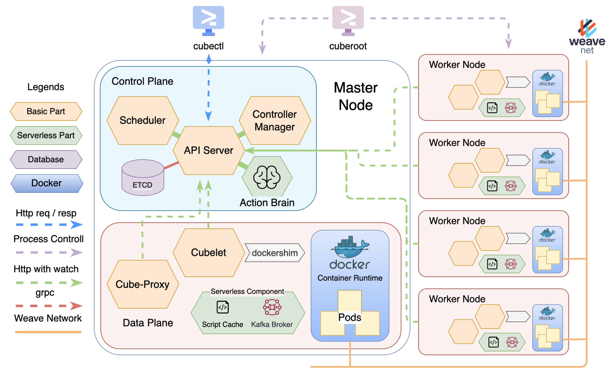

# Cubernetes验收报告

第8组

沈玮杭 519021910766

杨镇宇 519021910390

李逸岩 519021911103


## 架构介绍

### 使用的依赖

- 没有使用k8s.io组织下的任何依赖和库，没有使用Knative, openwhisk有关的任何依赖和库
- 没有使用CNI库，但容器间网络连接是利用Weave实现的
- 主要使用了etcd, kafka, iptables client封装对这些外部组件的操作


- 自行实现了简易的时序数据库作为Serverless动态扩缩容的依据

### 多机部署

- cuberoot通过是否存在元信息持久化文件判断应该新创建并且加入一个Cubernetes节点还是恢复之前的数据
- Scheduler调度优先满足Pod selector, 在匹配的Node集合中，Scheduler会进行Round Robin调度
- Worker通过监测Watch channel的状态判断Master的存货状态，周期性的重连实现容错
- Master通过心跳检测探测worker状态，更新ETCD中存储的Node状态

### Cubernetes网络

- 以Weave Plugin为基础，用户**无感知**的下载与配置插件，不需要用户额外配置任何网络
  - Pod中容器共享Pause提供的网络，Pause加入Weave net, Pod中容器共享Localhost
  - Container内可以通过任意节点的IP，任意Pod IP和Service IP 以及注册的域名访问对应服务
  - 动态节点加入与删除
- Service: 基于IPtables, 自动化的配置
  - 自定义多层规则链，相互引用，便于更新，删除，新增Service
- 容器化Nginx实现DNS服务
  - 观察到不同Path对应不同的IP超出了DNS职责，通过Nginx实现不同path到不同IP的转换
  - 复用Service进行Pod负载均衡

### GPU服务

通过负载均衡的部署GPU Server到各个节点上，复用原有的Pod管理机制。具体来说，由Cubernetes提供镜像，用户提交Slurm文件后，将运行相应的GPU Server Pod与远程HPC服务器进行交互，然后直接和API Server反馈任务状态和结果。用户通过cubectl进行查询。

### Serverless

#### Gateway

- 提供HTTP服务，接受HTTP Trigger并且返回Serverless计算结果
- Gateway构建为镜像，可以实现无感知更新；复用AutoScaler + Service做负载均衡，对外暴露固定的Service IP
- 通过Kafka Topic Partition机制实现消息队列的可扩展性
- 每个请求通过Go Channel和long-running的请求返回队列监听者通信，减少切换开销

#### 整体架构



<center>图1 Cubernetes整体架构图</center>

图1展示了Cubernetes的整体架构设计。与K8s类似，Cubernetes的组件也分为控制面和数据面。

控制面围绕中心的API Server进行设计，包含ETCD、Scheduler、Controller Manager和Action Brain等组件。ETCD中存放了各类api对象，暴露grpc供API Server读写。API Server则对外提供RESTFul的HTTP服务，以实现对api对象的访问和watch。Scheduler通过watch的方式监听API Server中Pod、Node等对象的变化，对Pod进行动态调度。Controller Manager也通过watch来管理ReplicaSet等对象。Action Brain则负责管理Serverless的相关功能。

数据面的组件在每一台服务器上均有运行，整体形成一个Node抽象。其中，Cubelet通过dockershim与docker后端交互，负责Pod生命周期的管理。CubeProxy则通过nginx容器实现DNS，通过设置iptable实现Service流量的转发，并通过Weave插件来打通Pod之间的网络通信。Cubelet和CubeProxy都通过watch和RESTFul接口访问API Server中的api对象。Serverless的组件以Pod的形式运行在各个机器上，并通过各机器上部属的Kafka消息队列进行通信，形成Serverless DAG。


#### Serverless 架构


<center>图2 Actor架构</center>

如图2所示，用户的函数称为Action，执行Action的Pod称为Actor。Actor里运行了Python解释器的容器，通过Volume Mount的方式加载用户函数脚本，在函数更新时也可以进行热重载，不必重启解释器。各个Actor之间通过Kafka消息队列连接，形成一条函数调用链。Actor消费一条调用请求（Invoke消息），执行用户函数，产生新的调用请求或返回值（Invoke或Response消息），放入对应接收者的消息队列中，同时还要发送调用记录给Action Brain，供其监控各个函数的调用次数，以便实现动态扩缩容以及函数冷启动时的快速响应。


<center>图3 Serverless Workflow调用逻辑</center>

图3展示了一个完整的Serverless Workflow的执行流程。用户调用函数时，Gateway收到用户请求后就封装一个Invoke消息，然后等待接收到Response消息后将内容返回给用户。Gateway和Actor都运行在Cubernetes集群之上，沿用了ReplicaSet的抽象，Kafka也以多机模式运行在各节点上，有良好的健壮性和可扩展性。整个架构呈现出一种流水线处理的形式，可以取得更高吞吐性能和更小的通信开销。值得注意的是，Cubernetes中并没有组件来处理函数调用分支，这是因为分支的逻辑包含在用户代码中，用户可以自由地选择下一个调用的函数是什么，Cubernetes只在Python运行时中做了合法性的检查，这样可以获得更高的编程灵活性，函数调用的写法也更符合程序员的逻辑。

#### ApiServer

软件栈：golang + gin


## 成员分工

<center>表1 成员分工与贡献度</center>

| 成员   | 工作                                                         | 贡献度 |
| ------ | ------------------------------------------------------------ | ------ |
| 沈玮杭 | API Server & Client、GPU Job Server、Serverless Python Runtime | 1/3    |
| 杨镇宇 | Cuberlet、Scheduler、Action Brain                            | 1/3    |
| 李逸岩 | CubeProxy、Controller Manager、Serverless Gateway、sufficient test | 1/3    |


## 工程实践

### Gitee 地址: 

- Cubernetes https://gitee.com/k9-s/Cubernetes
- Serverless Python框架 https://gitee.com/k9-s/Serverless-Python

### 项目分支

- master 项目主分支，长期存在。仅由develop branch通过pull request合入，合并时机为完成了一个完整的，经过集成测试的主要功能之后；
- develop 项目开发分支，长期存在。仅由功能分支通过pull request合入，合并时机为完成了一个经过测试的功能点之后；
- 其他功能分支，有明确的生命周期。在开启一项独立的任务之后，由任务负责开发者创建，将在任务开发完毕后合入develop分支(或者使用此分支feature的其他分支)并且删除。

### CI/CD

使用Gitee[仓库镜像](https://gitee.com/help/articles/4336)到Github私有仓库，使用Github Campus(白嫖)的Github Action time(3K minutes/month)进行CI. 使用的Workflow配置yaml文件可以参考附件1. 主要完成的工作：

* 运行`go build`确保编译通过
* 运行`go vet`捕获是否存在编译器未发现的错误
* 运行`staticcheck`进行静态代码检查
* 运行`go test`完成单元测试
* 如果CI不通过，会通过邮件通知小组

Github Action在镜像同步后会自动触发：


由于本身云操作系统并非持续服务的Web server或其他服务，因此没有进行持续部署。用于集成测试的部署方式是基于Jetbrain Deployment和Linux rsync进行同步与部署的：

- 在Jetbrain worker group 中创建两台JCloud服务器，填入ssh连接信息
- 配置rsync连接，将本地Cubernetes开发目录映射到部署目录，这一步需要排除build等目录
- 在Jetbrain Goland中配置rsync，在git merge/代码本地修改时触发rsync到远程服务器Group
- 在JCloud机器上进行构建和部署

### 软件测试

- 单元测试使用go test. test目录一般在相应组件目录下方，命名为`function_test.go`, 内部函数Pattern为`TestSomeFunction(t *testing.t)`签名的即为单元测试函数；
- 集成测试则使用`/example`下的yaml文件进行测试，并且通过docker, log等观察是否运行正常；
- 回归测试依靠CI进行；
- log 是进行Debug的主要工具，如果使用`cuberoot`启动Cubernetes，log会被重定向到`/var/log`，同时通过sync映射到本地便于查看。

###  新Feature开发流程

- 分工，如果和其他模块有交互部分需要讨论接口，涉及多个模块的需要会议讨论
  - 需要讨论接口的情形：如何向`iptables utils`发起创建规则链调用
  - 需要腾讯会议的情形：Serverless组件之间的进程间通信使用消息队列还是HTTP
  - 需要通过Git Wiki的情形：预研GPU CUDA程序的成员将Note记录在Wiki上
- 从Develop分支创建Branch并且推送至远程存储库
- 编写Feature所需的组件或者修改原有组件完成新Feature
- 编写单元测试，检查测试是否通过
- 编写对应的集成测试用例，在JCloud上部署并进行集成测试
- 推送到Gitee，Pull request, Git message 应该遵守[Conventional Commit](https://www.conventionalcommits.org/en/v1.0.0/), 即`<type>: <subject>`. 
  - 如果提交比较复杂，还要提交一份含有Body的Git message.
  - `<type>`应为`feat, fix, docs, refactor, test, chore, style`中的一种
- 进行code review, 然后合入Develop分支，Develop分支则需要经过完整的回归集成测试后才能合入主线

### 迭代流程

- 基础架构迭代
- 端到端迭代
- 高级功能迭代

## 功能介绍

### Init

```shell
./build/cuberoot init -f ./example/yaml/master-node.yaml
./build/cuberoot join 192.168.1.6 -f ./example/yaml/slave-node.yaml

# 可以展示
weave status peers
```

### Pod

```shell
# 展示基本Pod操作，command和资源限制
./build/cubectl apply -f ./example/yaml/presentation/pod/stress.yaml
# top / log看下CPU占用，应该是2个VM大致平分一个Core

./build/cubectl get pods
./build/cubectl describe pod

# 展示停止pod
./build/cubectl delete pod f8f5ce4e-5819-493e-a9c0-408b5c9b4560
# 已经没有这个Docker了

# 展示挂载卷，容器内localhost，暴露端口
# 记得回忆下tc的index.html有没有写入
# 这个Pod会被调度到另一台机器上
./build/cubectl apply -f ./example/yaml/presentation/pod/tn.yaml
# 展示Volume的网页
curl 127.0.0.1:8095
curl 127.0.0.1:8090

docker exec -it xxx bash
curl 127.0.0.1:8080
# 至此，Pod要求已经全部实现了
```

### GPU

由于GPU任务可能发生排队，可以提前检查。

```shell
./build/cubectl apply -f ./example/yaml/presentation/gpu/gpu-add.yaml
./build/cubectl apply -f ./example/yaml/presentation/gpu/gpu-mult.yaml

# Job也有基本的RR负载均衡
./build/cubectl get gpuJobs
./build/cubectl describe GpuJob
```

### Svc

这部分将和RS, DNS一起检查，先检查SVC与负载均衡，再检查杀死Pod之后的行为；最后检查DNS.

```shell
./build/cubectl apply -f ./example/yaml/presentation/rs.yaml

./build/cubectl get rs
./build/cubectl apply -f ./example/yaml/presentation/svc-1.yaml
./build/cubectl apply -f ./example/yaml/presentation/svc-2.yaml

# 回填svc ID
curl 172.16.0.0:8080
curl 172.16.0.1:80

./build/cubectl apply -f ./example/yaml/presentation/dns.yaml
./build/cubectl describe dns xxx

curl example.cubernetes.weave.local/test/cubernetes/nb
curl example.cubernetes.weave.local/test/cubernetes/very/nb

# 展示docker内也可以访问DNS与Svc
docker exec it ...

# 删除Pod尝试
./build/cubectl get rs
./build/cubectl describe rs x
./build/cubectl delete pod
# Waiting...
./build/cubectl describe rs
```

### AS

```shell
# Keep scaling
./build/cubectl apply -f ./example/yaml/presentation/autoscaler-cpu.yaml

./build/cubectl get autoscaler 
./build/cubectl describe autoscaler 732f4c11-165c-445e-9779-ea8bfb369d62
# Scale to more, then drop to 1
./build/cubectl apply -f ./example/yaml/presentation/autoscaler-memory.yaml

# waiting...
./build/cubectl describe autoscaler
```

### 容错

```shell
./build/cuberoot stop
# 检查Pod IP和Service
curl podIP
curl serviceIP

./build/cuberoot start
# 检查Pod IP和Service
curl podIP
curl serviceIP
```

### Schedule

这部分将运行2个符合仅符合一个node标签的Pod, 观察他们是否被部署到了唯一符合的node上。同时作为容错恢复后的检查。

```shell
./build/cubectl apply -f ./example/yaml/presentation/onemoreRS.yaml

./build/cubectl describe pod
# Only stay in worker 1
```

### Serverless

需要保证所有机器上拥有镜像：`yiyanleee/python-runtime:v1.5` & `yiyanleee/serverless-gateway:v1`

```shell
./build/cuberoot serverless enable
./build/cubectl apply -f example/serverless/hello/hello.yaml
./build/cubectl apply -f example/serverless/hello/ingress.yaml

curl "172.16.0.0:6810/hello?name=serverless" # Change to service IP
```

### Finally

```shell
./build/cuberoot reset
./build/cuberoot stop
bash ./scripts/clear.sh
```


## 附件1 CI Yaml

```yaml
name: Go

on: [pull_request, push]

jobs:
  build:
    runs-on: ubuntu-latest
    steps:
      - uses: actions/checkout@v3

      - name: Set up Go
        uses: actions/setup-go@v3
        with:
          go-version: 1.18

      - name: Build
        run: make

      - name: Run go vet
        run: go vet ./...

      - name: Install staticcheck
        run: go install honnef.co/go/tools/cmd/staticcheck@latest

      - name: Run staticcheck
        run: staticcheck ./...

      - name: Go Test
        run: go test -v ./...
```

